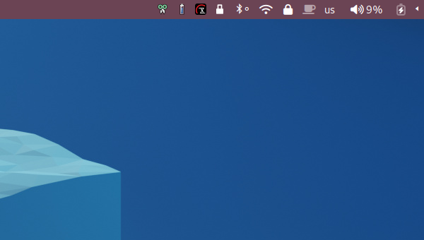
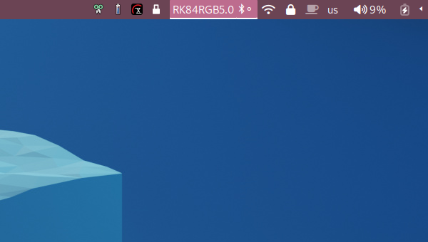
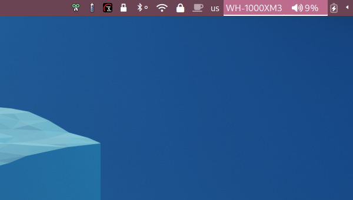
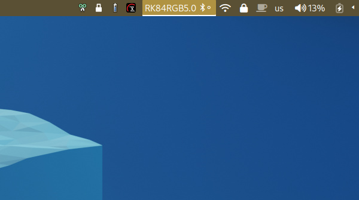
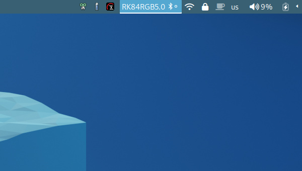
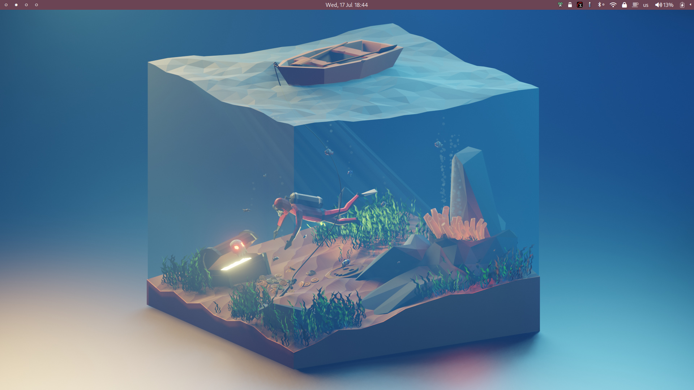

# Sleek Waybar Configuration
Introducing a feature-rich and unobtrusive Waybar configuration designed for seamless customization and effortless tweaking. This status bar enhances your desktop experience while maintaining a clean aesthetic.eful, unobtrusive waybar configuration designed to be easily tweaked and customized \

# Animated
Popular status bar options like swaybar and yambar, and most waybar configurations, don't communicate interactivity. should respond to mouse movements, providing a polished feel and enhancing discoverability. Experience the difference with animated elements that react to your interactions.

<video controls="" src="/krats/waybar-sleek/raw/branch/master/docs/demonstration.webm">
	<strong>Your browser does not support the HTML5 "video" tag.</strong>
</video>

# Minimal
This status bar features a minimalist design that expands contextually to display relevant information. This approach allows users to quickly identify active and inactive states at a glance, ensuring a streamlined workflow.
 

# Easy Configuration
Simply edit the base color in style.css using the line @define-color base-bg #RRGGBB, and interactive colors will always match. Tailor your status bar to match your personal style effortlessly.

